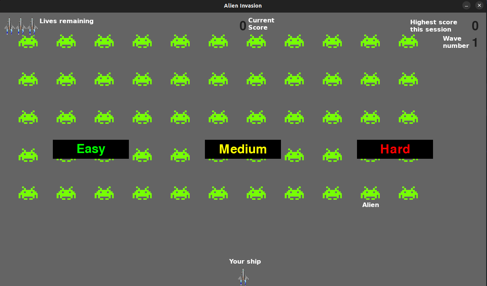

# Alien-Invasion-Game

Alien Invasion is an arcade game, based on a popular *"Space Invaders"*.

This game has been written using Python, as a capstone project from 
*"Python Crash Course"* book by Eric Matthes.

## How to run Alien Invasion:

* Fetch the entire content of this repository;
* Enter the directory which contains the game, e.g.:
```
cd /home/user/downloads/Alien_Invasion_Game
```
* Run the main game file (alien_invasion.py) with python:
    * For Windows:
    ```
    python alien_invasion.py
    ```
    * For Linux:
    ```
    python3 alien_invasion.py
    ```
## How to play:

You are commander of a space ship, ordered to stop the invasion of Aliens!

Alone and overwhelmed, you cannot win this game. You can, however, take down
with you as many Aliens as possible.

What can you see in the game window:


On the bottom of the screen is you ship. It can move to the left and right and shoot bullets. One bullet kills one Alien, if hits.

The green guys are the Aliens. If you kill the entire wave - next wave will appear and the game will speed up. If even one Alien reaches the bottom of\ the screen or your ship - you will lose one life. If you loose all your lives the game is over.

You can choose between three difficulty levels. The difficult levels defines how quickly the Aliens speed will increase with each wave, and how many points you will get for shooting them.

## Contributing:

Pull requests are welcome. You can also contact me on jakub.berkowski@gmail.com

## License:

[MIT License](https://choosealicense.com/licenses/mit/)
